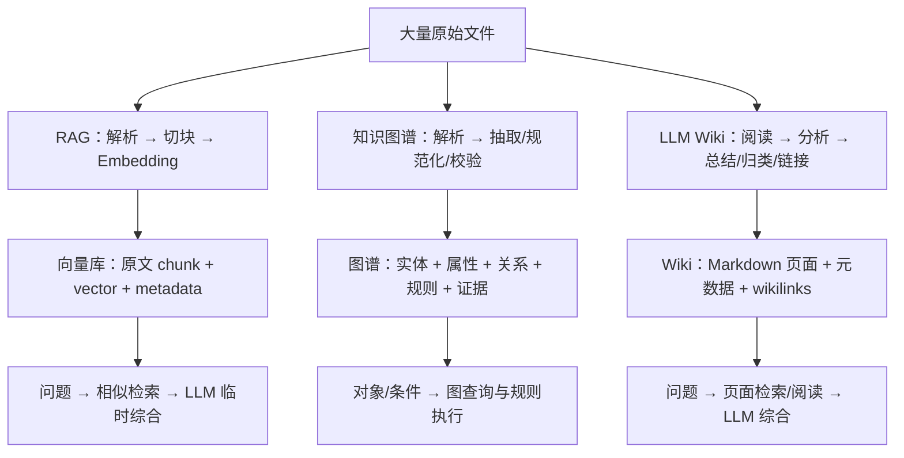
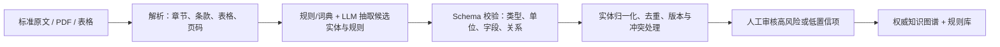
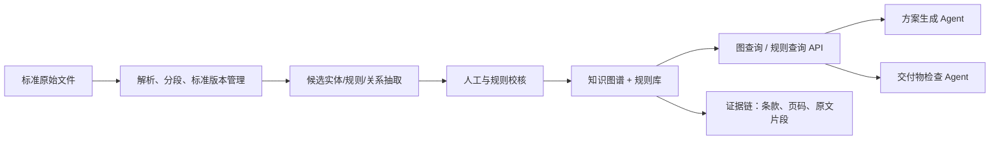

# 工程标准知识库：RAG、知识图谱与 LLM Wiki 技术路线

## 1. 通识：三种从原始文件构建知识库的方法

面对大量 PDF、Word、表格、网页或其他原始文件，RAG、知识图谱和 LLM Wiki 都能“构建知识库”，但它们提炼知识的方式、最终数据库形态和查询机制完全不同。

| 方法 | 如何处理原始文件 | 最终构建出的数据库 | 查询时的核心动作 |
| --- | --- | --- | --- |
| RAG | 解析、切块、向量化 | 向量数据库 + 原文片段索引 | 找相似原文片段，再由 LLM 临时综合 |
| 知识图谱 | 抽取、规范化、校验实体/关系/规则/证据 | 图数据库 + 规则库 | 查结构化事实、关系和适用约束，必要时执行规则 |
| LLM Wiki | 阅读、总结、归类、交叉引用、持续更新页面 | 互联的 Markdown 知识页面集合 | 搜索和阅读已经整理过的页面，再由 LLM 综合 |



### 1.1 RAG：构建“可语义检索的原文片段库”

RAG（Retrieval-Augmented Generation，检索增强生成）通常不把文档先转化为明确的领域知识，而是让原文变得易于被找到。

```text
原始文件
  → 文本解析
  → 按长度或语义分段（chunk）
  → 为每个片段生成 embedding 向量
  → 写入向量数据库
```

最终的核心数据类似：

```text
Chunk {
  id,
  text: "原始文件中的一段文字",
  vector: [0.12, -0.03, ...],
  metadata: { source_file, version, page, section }
}
```

提问“压力超过 1.6 MPa 时，管道等级有什么要求？”时，系统将问题向量化，检索最相似的原文片段，再把它们交给 LLM 解释和回答。

因此，RAG 的数据库本质是：**原文片段的向量索引库**。它解决的是“相关原文在哪里”，而不是直接解决“哪些规则适用、是否合规”。每次查询，LLM 都需要重新理解条款、条件、例外和结论。

### 1.2 知识图谱：构建“结构化事实、规则与证据网络”

知识图谱将原始文件中的内容拆解为可被机器识别、查询和组合的知识单元。对于工程标准场景，除实体和关系外，规则、条件、例外、版本和证据同样是一等对象。

```text
原始文件
  → 文本、标题、表格、页码解析
  → 候选实体、属性、关系、规则与例外抽取
  → 绑定条款、页码和原文证据
  → 结构校验与人工审核
  → 写入图数据库 / 规则库
```

例如原始条款：

> 当设备处于区域 A、介质为 B 且压力超过 1.6 MPa 时，管道等级不得低于 X。

可以转为：

```text
(管道) -[:受规则约束]-> (R-001)

(R-001) {
  conditions: 区域 = A；介质 = B；压力 > 1.6 MPa
  requirement: 管道等级 >= X
}

(R-001) -[:依据]-> (标准 S-2025 第 4.2.1 条)
```

知识图谱的数据库本质是：**实体、属性、显式关系、规则、版本和证据组成的结构化网络**。给定对象与工况后，系统可先找到适用规则，再执行条件判断，最后返回结论及其条款、页码和原文证据。

### 1.3 LLM Wiki：构建“持续维护的知识页面集合”

LLM Wiki 的产物不是原文片段，也不必将每条内容严格拆为结构化三元组或规则。它是在资料导入时让 LLM 阅读、综合并维护一组可读的知识页面。

```text
原始文件
  → LLM 阅读与分析
  → 生成来源摘要页
  → 新建/更新实体页、概念页、专题页
  → 加入 [[交叉链接]]
  → 更新目录、总览与变更日志
```

最终可能形成：

```text
wiki/
  sources/标准-S-2025.md
  entities/管道等级.md
  entities/区域-A.md
  concepts/压力分级.md
  overview.md
  index.md
```

LLM Wiki 的数据库本质是：**由 LLM 生成并互相链接的 Markdown 页面库**。它擅长沉淀解释、背景、跨文档综合和人类阅读；其答案通常来自已经整理的页面，而非每次重读原始文件。

### 1.4 一句话区分

```text
RAG：原始文件 → 可检索片段；回答“原文在哪里？”
知识图谱：原始文件 → 事实、关系、规则、证据；回答“哪些规则适用、是否合规？”
LLM Wiki：原始文件 → 可读的总结和知识页面；回答“资料整体如何理解和组织？”
```

## 2. 知识图谱自动化构建

知识图谱的自动化构建不是“人工建图”与“让 LLM 直接读文件建图”之间的二选一。更可靠的方式是：**人工定义最小 Schema → 算法或 LLM 批量抽取候选知识 → 程序校验、归一化和去重 → 人工审核高风险项 → 入库**。

### 2.1 Schema 与图谱实例

Schema（也可称本体或领域模型）定义的是系统允许表达什么，类似数据库的表结构加上业务语义。例如：

```text
实体类型：Standard、Clause、Equipment、Material、ConstraintRule、Evidence
关系类型：
- CONTAINS：Standard → Clause
- APPLIES_TO：ConstraintRule → Equipment
- REQUIRES：ConstraintRule → Property / Value
- EVIDENCED_BY：ConstraintRule → Evidence
- EXCEPTION_TO：Exception → ConstraintRule
```

图谱实例则是从文件中提取出的具体对象和关系：

```text
(标准 GB-xxx-2025) -[:CONTAINS]-> (第 4.2.1 条)
(R-001: 最低管道等级要求) -[:APPLIES_TO]-> (管道)
(R-001) -[:EVIDENCED_BY]-> (GB-xxx-2025，第 4.2.1 条)
```

Schema 的价值不在于让图谱“好看”，而在于规定下游系统能查询和验证什么。没有能够表达条件、比较符、数值、单位、例外和证据的 Schema，模型即使读懂条款，也只能将其写成自然语言描述，无法稳定地用于合规检查。

### 2.2 自动抽取的三类技术

**传统 NLP 与规则算法**适合确定性内容：OCR/版面识别、章节和条款编号、标准编号、数值、单位、日期、固定模板与表格字段。常用技术包括词典、正则、命名实体识别（NER）、依存句法、关系分类、表格解析、字符串/向量相似度去重。

**LLM 按 Schema 抽取**适合复杂自然语言：跨句条件、例外条款、上下文指代和非固定写法。输入原文片段及 Schema，要求模型输出 JSON 或规则 DSL；输出仅是候选知识，不能直接作为权威事实。

**Schema 自动发现（schema induction / ontology learning）**可从大量文件中建议常见概念和关系，用于帮助启动建模；但它发现的是文本共现模式，不必然符合下游工程检查需要，因此不能不经领域审查直接作为最终 Schema。

### 2.3 推荐的自动化流水线



推荐分工如下：

| 环节 | 优先方法 |
| --- | --- |
| OCR、章节/页码/表格定位 | 确定性解析算法 |
| 标准编号、条款编号、单位、阈值、日期 | 正则、规则、词典 |
| 复杂条件、例外、跨句约束 | LLM 的 Schema 约束抽取 |
| 同义词归一化、实体合并 | 主数据/词典 + 相似度 + 人工确认 |
| 字段、单位、关系和版本校验 | 程序化 Schema 校验 |
| 强制性规则、冲突、低置信结果 | 人工审核 |
| 最终合规判定 | 规则引擎，而非 LLM 自由判断 |

### 2.4 从最小可用 Schema 开始

Schema 不必一开始大而全，但必须能精确承载第一批要自动执行的工程判断。对一类标准约束，可从以下规则模型开始：

```text
Rule
- applies_to：适用对象
- conditions[]：条件
- requirement：要求或禁止
- operator：>, >=, =, <= 等
- value + unit：阈值与单位
- exception[]：例外
- evidence：条款、页码、原文片段
- standard_version：标准版本
```

之后应以真实文件和失败案例迭代：出现“满足 A 或 B”时引入逻辑组；出现规则冲突时加入优先级和替代关系；出现项目阶段差异时加入适用阶段。正确过程是：

```text
选择一个明确的下游检查场景
→ 反推最少规则字段
→ 用真实文件跑抽取
→ 观察漏项、歧义和检查失败
→ 迭代 Schema、提示/算法和校验规则
```

LLM 可以在既定结构内提高复杂文本的理解和提取覆盖率，但不能弥补 Schema 缺失的结构。它应提出候选知识；权威规则必须经过结构校验、证据绑定与必要的人审。

## 3. 工程标准知识库的技术选型结论

对于“将工程领域标准化文件转化为知识库，并供下游 Agent 生成方案和检查交付物”的目标，**知识图谱与规则库应作为唯一的权威知识层（source of truth）**。

第一阶段**不建设 LLM Wiki**。它不是实现严格查询、约束推理和自动检查的必要组件；在当前范围内引入它会增加一份派生数据、一个检索入口和一套同步/质量控制流程，收益不足以抵消复杂度与一致性风险。

未来只有在出现大量“需要解释但不参与合规判定”的知识需求时，再评估是否增加轻量说明层；即使增加，也不应使其成为规则依据或独立事实源。

## 4. 项目目标与核心要求

本项目面向工程标准、规范、规程等标准化文件，构建可被下游 Agent 消费的工程标准知识库。典型能力包括：

- 查询某个工程对象、工况或交付物应遵守的标准与约束；
- 在生成新方案时，取得适用规则、边界条件与例外条件；
- 在检查交付物时，对照规则输出通过、失败或证据不足；
- 回溯每条结论的标准版本、条款、页码、表格或原文片段；
- 管理标准更新、生效状态、适用范围、冲突与优先级。

这些能力的共同要求是：**规则可计算、结果可复现、依据可追溯、版本可治理**。

## 5. LLM Wiki 的技术路线

LLM Wiki 是一种“增量编译知识”的模式：不在每次问答时从原始文档重新检索和综合，而是在资料导入时由 LLM 生成并持续维护一组相互链接的 Markdown 页面。

### 5.1 三层结构

```text
原始资料层（不可变）
  └─ PDF、Word、网页、表格等原始文件

Wiki 层（LLM 生成、持续维护）
  └─ 来源摘要、实体页、概念页、索引、总览、日志

Schema / Purpose 层（约束 LLM）
  └─ 页面类型、目录结构、元数据、工作流和知识库目标
```

原始资料不被替换。所谓“压缩”是将原文做有损但可追溯的语义提炼：保留来源，同时将重点信息分散写入可读的主题页面。

### 5.2 典型导入流程

```text
原始文件
  → 文本/PDF/图片解析
  → LLM 第 1 步：识别实体、概念、论点、冲突和关联
  → LLM 第 2 步：生成/更新 Markdown 页面和 [[wikilink]]
  → 维护 index、overview、log 与页面来源字段
  → 可选：分块 Embedding、向量检索、页面链接图可视化
```

LLM Wiki 适用于研究笔记、专题研究、组织知识沉淀等“长文本解释和跨文档综合”占主导的场景。它的主要产物是供人和 LLM 阅读的叙事性知识页面。

## 6. 知识图谱与 LLM Wiki 的差别

| 维度 | LLM Wiki | 工程标准知识图谱 / 规则库 |
| --- | --- | --- |
| 核心单位 | 可读的主题 Markdown 页面 | 实体、属性、关系、约束规则与证据 |
| 关系含义 | 通常是泛化的“相关/链接” | 明确的受控关系，如适用、要求、禁止、引用、例外、优先于 |
| 约束表达 | 自然语言，需由 LLM 再解释 | 条件、操作符、阈值、单位、例外可结构化表达 |
| 查询 | 关键词、向量与页面链接检索 | 图查询、规则查询、可追溯的适用性判断 |
| 推理与检查 | 非确定性，依赖模型理解 | 可执行、可复现，可输出通过/失败/证据不足 |
| 溯源粒度 | 常见为页面级 `sources[]` | 可到规则、关系甚至原文片段级 |
| 版本治理 | 适合文档版本与页面版本 | 可管理标准版本、生效日期、废止状态与规则优先级 |
| 最适用场景 | 阅读、综述、解释和探索 | 合规、约束驱动生成、自动检查和决策 |

一个工程标准的句子，例如：

> 当设备处于区域 A、介质为 B 且压力超过 1.6 MPa 时，管道等级必须不低于 X。

在 Wiki 中，它多是一段说明文字；下游 Agent 每次仍需要由 LLM 解读条件和结论。

在规则图谱中，应表示为可执行的规则对象：

```text
Rule R-001
  applies_to: Pipe
  conditions:
    zone = A
    medium = B
    pressure > 1.6 MPa
  requirement:
    pipe_class >= X
  authority:
    Standard S-2025, clause 4.2.1
  lifecycle:
    version / effective_date / status
```

这样，生成 Agent 可以取得“当前条件下适用的规则集合”；检查 Agent 可以把交付物参数逐项与规则比对。

## 7. 为什么当前不采用 LLM Wiki

LLM Wiki 的价值在当前主链路中较小，而成本与风险明确：

- **重复数据与同步成本**：它会产生另一份从标准原文派生的知识，需与图谱规则、版本和证据持续一致。
- **权威性模糊**：下游 Agent 可能从 Wiki 摘要和规则图谱得到不同表述，难以判定谁是最终依据。
- **精度风险**：自然语言摘要容易弱化“必须/应当”、适用条件、数值阈值、单位和例外条款。
- **工程复杂度**：需要增加 LLM 生成、输出格式校验、页面更新、冲突处理、检索路由与质量评估。
- **检查不可确定**：Wiki 需要 LLM 再次理解；同一输入可能得到不同判断，不适合作为合规判定的依据。

因此，不能因为 LLM Wiki “更易读”就让它进入规则决策链。工程标准库中，准确、可验证和可追溯优先于叙事性。

## 8. 推荐的第一阶段架构



### 8.1 建议的知识对象

- `Standard`：标准文件及其编号、版本、生效/废止状态；
- `Clause`：章节、条款、表格、附录等可定位单元；
- `EngineeringObject`：设备、管道、材料、工艺、交付物等对象；
- `Property`：压力、温度、区域、介质、等级、尺寸等属性；
- `ConstraintRule`：条件、操作符、阈值、结论、严重等级；
- `Exception`：豁免、特殊工况、替代性要求；
- `Evidence`：原文片段、页码、表格单元格或坐标；
- `Applicability`：规则与对象/工况/项目范围之间的适用关系。

### 8.2 规则最小字段

每条可被 Agent 消费的规则至少应具备：

```text
rule_id
subject / applies_to
conditions
operator + expected value + unit
requirement_or_prohibition
exceptions
priority / conflict policy
standard_id + version + status + effective_date
evidence_locator + source_excerpt
confidence + review_status
```

### 8.3 下游 Agent 的消费边界

- **生成 Agent**：先查询适用规则，再生成方案；输出时标记每项设计选择所依据的规则 ID。
- **检查 Agent**：将交付物解析为结构化事实，与规则执行结果比较；返回 `pass`、`fail` 或 `insufficient_evidence`。
- **问答 Agent**：可以使用原文片段辅助解释，但最终结论必须引用规则 ID 和证据定位。

## 9. LLM 的合理位置

不建设 LLM Wiki 不等于完全不能使用 LLM。LLM 可以作为非权威的生产力工具，且所有结果都需要进入结构化校验流程：

- 从原始标准中提取候选实体、属性、规则与证据定位；
- 将自然语言条款转为候选规则 DSL/JSON；
- 发现可能冲突、缺失字段或版本差异；
- 辅助解释规则执行结果。

关键边界是：**LLM 可以提出候选知识，不能绕过校验直接成为权威规则。** 权威规则必须经过结构校验、证据绑定和必要的人工审核。

## 10. 未来何时重新评估 Wiki

仅当出现下列需求时，再考虑添加轻量说明层：

- 专家频繁需要了解规则的工程背景、设计意图或历史沿革；
- 需要积累大量不参与自动合规判断的工程经验、案例与常见误区；
- 大量跨标准对比和长篇综述对人工协作有明确价值；
- 下游 Agent 需要阅读性上下文，但这些内容不能作为规则依据。

即使出现上述需求，建议先在图谱节点/规则对象上增加 `description`、`example`、`rationale` 等字段，而不是立即新增完整 LLM Wiki。若最终引入 Wiki，必须遵循：

1. 图谱与规则库仍是唯一权威来源；
2. Wiki 仅展示和解释已批准的规则，不直接参与合规判定；
3. 每段说明应链接到规则 ID 和证据；
4. Wiki 生成失败或过期不得影响生成、检查和查询主链路。

## 11. 当前技术决策

**决策：采用“原始标准文件 + 证据化知识图谱 + 可执行规则库 + Agent 查询接口”的路线；第一阶段不引入 LLM Wiki。**

该决策的目的，是优先建立可验证、可追溯、可版本化、可被下游 Agent 稳定消费的工程标准能力，并避免引入与核心目标不匹配的派生知识层。
